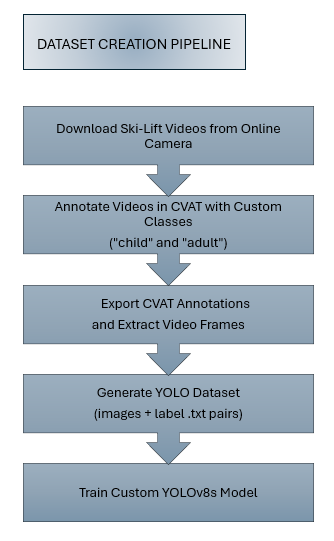
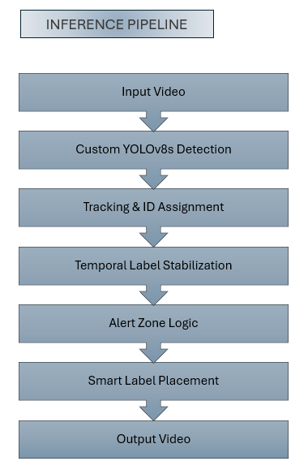
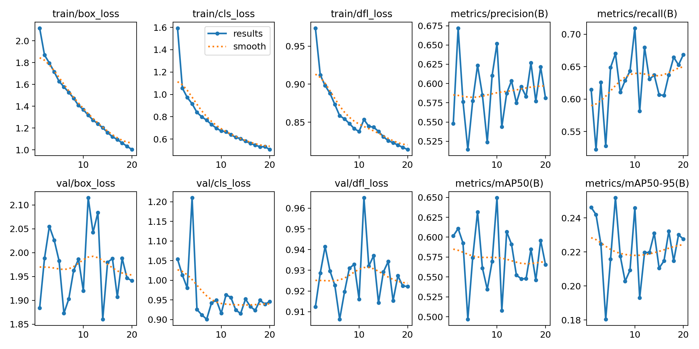

# Ski Lift Safety Detection

Computer vision project for child/adult detection and ski lift safety monitoring using a custom-trained YOLOv8s model, temporal tracking, label stabilization, and alert-zone logic. The project includes custom dataset creation using CVAT, manual annotation of ski-lift footage collected from online cameras, and tracking-aware labeling with custom `child` and `adult` classes.

---

## Overview

This project demonstrates a complete computer vision pipeline built around:

* YOLO dataset preparation
* custom YOLOv8s training
* child/adult classification
* object tracking across frames
* improved tracking stability during short detection interruptions
* temporal classification stabilization
* smart label placement and smoothing
* alert-zone detection
* alert persistence logic


The system was developed and tested on real ski-lift footage.

---


## Demo

### Default YOLOv8 vs Custom Trained YOLOv8s

The demo below compares:

1. Default YOLOv8 person detection
2. Custom-trained YOLOv8s child/adult classification

<p align="center">
  
</p>

<p align="center">
  <a href="docs/demo.mp4">View HD Version</a>
</p>

---

## Full Output Example

The complete inference result is available below:

<p align="center">
  <a href="docs/full_output.mp4">View Full Output Video</a>
</p>


---


## Dataset Creation Pipeline



This pipeline illustrates the workflow used to create the custom training dataset, from video collection and annotation to YOLO dataset generation and model training.

---

## Detection and Tracking Pipeline



This pipeline illustrates the runtime processing flow, including custom YOLOv8s detection, object tracking, temporal label stabilization, alert logic, and output video generation.


## Features


### YOLO dataset preparation

* precise annotation of videos downloaded from an online camera, with custom classes ("child" and "adult") in CVAT 
* export and sample CVAT annotations, pairing the obtained frames with the corresponding YOLO .txt files

### Custom YOLOv8s Training

* train YOLOv8s model on a relatively small manually annotated dataset
* training performed on CPU
* new classes introduced: `child` and `adult`
* improved detection quality compared to default YOLO person detection

### Training Results

Child class was significantly more challenging due to:

        - smaller object size
        - partial occlusions
        - lower representation in dataset (adults are more presented on Ski Lift)


* final custom-trained YOLOv8s model (20 epochs):

        - Precision: 0.623
        - Recall: 0.672
        - mAP50: 0.632
        - mAP50-95: 0.252

        Class-specific performance:
        - Adult: mAP50 = 0.870
        - Child: mAP50 = 0.394


        


### Temporal Tracking

* center-distance based tracking
* persistent IDs across frames
* track aging and cleanup logic
* temporary occlusion tolerance

### Label Stabilization

Classification smoothing across multiple frames:

* reduces label flickering
* stabilizes child/adult classification
* majority-vote temporal logic

### Smart Label Placement

* multiple candidate label positions
* overlap avoidance
* label-slot locking
* smoothed label movement
* leader-line rendering

### Alert System

* configurable alert line (cross-line)
* child detection alerts
* repeated-trigger prevention using cutoff line
* persistent visual alert state

---

## Project Structure

```text
project_root/
│
├── dataset/
│   └── sample/
│        └── images
│            └── train
│            └── val
│        └── labels
│            └── train
│            └── val
├── docs/
│   ├── demo.mp4
│   ├── full_output.mp4
│   ├── confusion_matrix.png
│   ├── training_results.csv
│   └── training_results.png
│
├── models/
│   └── yolov8s_fine_tuned
│       └── best.pt
│
├── scripts/
│   └── main.py
│
├── videos/
│   └── sample_input.mp4
│
├── data.yaml
├── README.md
└── requirements.txt
```

---

## Technologies Used

* Python
* OpenCV
* Ultralytics YOLOv8
* NumPy

---

## Training

Example training command:


        yolo detect train data=data.yaml model=yolov8s.pt epochs=20 imgsz=640


---

## Model Performance

The custom-trained YOLOv8s model demonstrated:

* better child/adult differentiation
* more stable detections
* improved localization quality
* improved visual tracking consistency

especially in:

* partially occluded scenes
* crowded ski-lift situations
* moving subjects

---

## Notes

* The current implementation uses scene-calibrated pixel coordinates. To preserve correct alert-zone and line alignment,
  input videos should match the reference resolution (1600x900)
* Alert lines and zones are tuned for the provided sample video geometry
* Full dataset is not included in the repository due to size

---

## Future Improvements

Potential future directions:

* resolution-independent geometry scaling
* stronger tracking association methods
* IoU-based matching
* Hungarian assignment tracking
* larger and more diverse training dataset
* GPU training/inference optimization

---

## Author

Developed as a computer vision and tracking engineering project focused on dataset creating, practical YOLO customization, tracking stability and safety-oriented scene logic.
